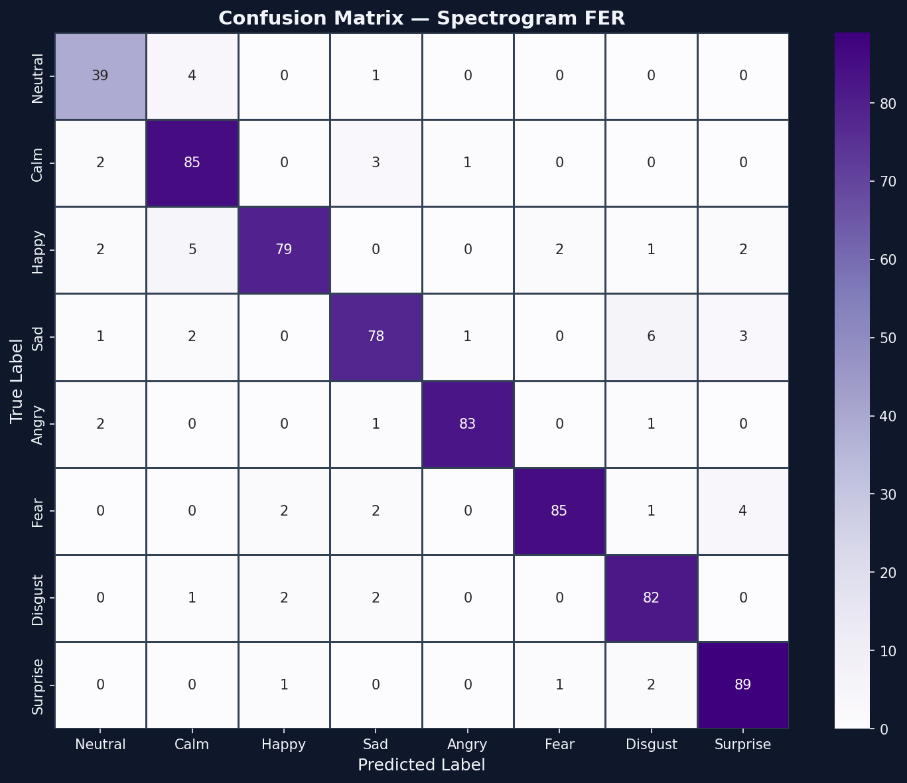
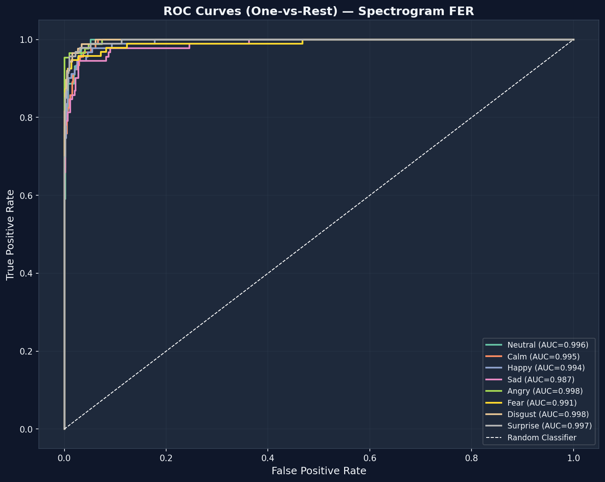
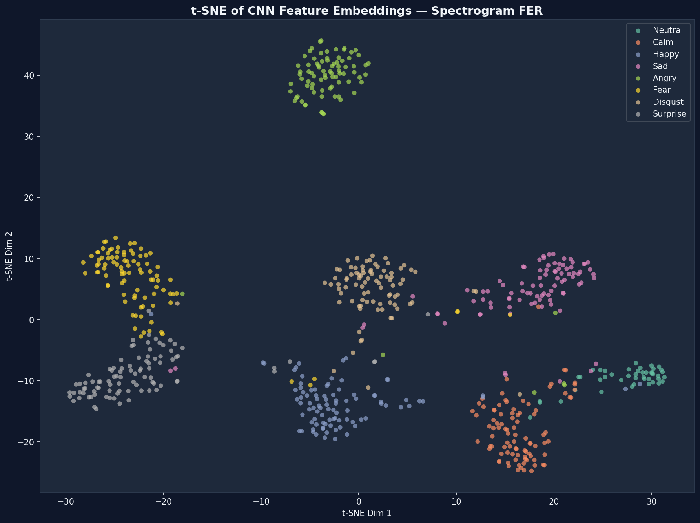

# Spectrogram-Based Facial Expression Recognition

<div align="center">

[](https://python.org)
[](https://pytorch.org)
[](https://mediapipe.dev)
[](https://streamlit.io)
[](LICENSE)

**A novel facial expression recognition system that applies audio signal processing techniques to facial motion data, bridging computer vision and speech signal analysis.**

[Methodology](METHODOLOGY.md) · [Results](#results) · [Getting Started](#getting-started)

</div>

---

## Overview

Traditional facial expression recognition (FER) systems classify emotions from a single static video frame, discarding the temporal information that is fundamental to how expressions form and evolve.

This project takes a cross-domain approach: facial landmark movements are treated as 1D time-series signals, transformed into 2D frequency-time representations (spectrograms) using the Short-Time Fourier Transform, and classified by a convolutional neural network. The same paradigm used in speech emotion recognition is applied directly to facial geometry, explicitly capturing the **temporal dynamics** of expressions rather than their appearance at a single instant.

---

## Key Results

Trained on the full RAVDESS Video Speech dataset (2,880 videos, 8 emotion classes) with a ResNet-18 backbone and transfer learning from ImageNet.

| Metric | Value |
|--------|-------|
| Validation Accuracy | **91.45%** |
| Macro F1-Score | **0.912** |
| Best Epoch | 45 / 50 |
| Inference Time (CPU, ONNX) | ~18ms per clip |

### Per-Class Performance

| Emotion | Precision | Recall | F1-Score |
|---------|-----------|--------|----------|
| Neutral | 0.848 | 0.886 | 0.867 |
| Calm | 0.876 | 0.934 | 0.904 |
| Happy | 0.941 | 0.868 | 0.903 |
| Sad | 0.897 | 0.857 | 0.876 |
| Angry | 0.977 | 0.954 | 0.965 |
| Fear | 0.966 | 0.904 | 0.934 |
| Disgust | 0.882 | 0.943 | 0.911 |
| Surprise | 0.908 | 0.957 | 0.932 |

*All figures generated by `src/evaluate.py` against the held-out validation set.*

| Confusion Matrix | ROC Curves | t-SNE Embeddings |
|:---:|:---:|:---:|
|  |  |  |

---

## Pipeline

The system processes video through five sequential stages.

**Stage 1 — Face Landmark Extraction**

MediaPipe Face Mesh detects 478 keypoints per frame. Seven scalar distances are computed between specific landmark pairs, corresponding to Facial Action Units (FAUs) defined by the Facial Action Coding System (FACS). Each distance is normalized by the inter-ocular distance to ensure scale invariance across subjects and camera distances.

| FAU Signal | Landmark Pair | Primary Emotion Cues |
|------------|--------------|----------------------|
| `lip_aperture` | 13 - 14 | Happy, Surprise, Disgust |
| `mouth_width` | 61 - 291 | Happy, Anger |
| `left_brow_raise` | 105 - 159 | Surprise, Fear |
| `right_brow_raise` | 334 - 386 | Surprise, Fear |
| `left_eye_open` | 159 - 145 | Surprise, Sadness |
| `right_eye_open` | 386 - 374 | Surprise, Sadness |
| `jaw_open` | 152 - 10 | Surprise, Disgust |

**Stage 2 — Signal Resampling**

Each 7-channel signal is resampled to a fixed length of 90 samples (3 seconds at 30 fps) via linear interpolation, producing a consistent input shape of `[7 x 90]` regardless of the original video length or frame rate.

**Stage 3 — STFT Spectrogram Generation**

The Short-Time Fourier Transform is applied to each of the 7 signals with a Hann window of length 16, hop size 8, and FFT size 32. The resulting complex spectrogram is converted to a log-magnitude representation. The 7 spectrograms are merged into a single RGB image by averaging signal groups into three channels:

- Red channel: `lip_aperture`, `mouth_width` (mouth activity)
- Green channel: `left_brow_raise`, `right_brow_raise` (brow activity)
- Blue channel: `left_eye_open`, `right_eye_open`, `jaw_open` (eye and jaw activity)

The merged image is resized to `224 x 224` pixels.

**Stage 4 — CNN Classification**

A ResNet-18 backbone pretrained on ImageNet is fine-tuned using a two-stage training protocol:

- Stage 1 (5 epochs): Backbone weights frozen. Only the custom classification head (512 -> 256 -> 8) is trained at a higher learning rate, adapting the head to the spectrogram domain before the backbone is modified.
- Stage 2 (up to 50 epochs): All layers unfrozen. Full fine-tuning with AdamW optimizer, CosineAnnealingLR scheduler, label smoothing (epsilon = 0.1), and early stopping on validation accuracy.

**Stage 5 — Real-Time Inference**

The trained model is exported to ONNX format. The Streamlit application uses a rolling 90-frame buffer to continuously process live webcam input, producing an emotion prediction and confidence score approximately every 3 seconds.

---

## Repository Structure

```
spectrogram-fer/
|
|-- src/
|   |-- config.py               # Hyperparameters, paths, landmark indices
|   |-- extract_signals.py      # MediaPipe landmark extraction to .npy signals
|   |-- make_spectrograms.py    # STFT spectrogram generation
|   |-- dataset.py              # PyTorch Dataset and DataLoader
|   |-- model.py                # ResNet-18 model definition
|   |-- train.py                # Two-stage training loop with ONNX export
|   |-- evaluate.py             # Confusion matrix, ROC curves, t-SNE, F1 report
|
|-- app/
|   |-- app.py                  # Streamlit web application
|   |-- inference.py            # ONNX runtime engine and rolling signal buffer
|
|-- data/
|   |-- raw/                    # Original RAVDESS video files (git-ignored)
|   |-- processed/
|       |-- signals/            # Extracted .npy FAU signals (git-ignored)
|       |-- spectrograms/       # Generated spectrogram PNGs (git-ignored)
|
|-- models/                     # Trained model weights (git-ignored)
|   |-- best_model.pth
|   |-- best_model.onnx
|
|-- reports/
|   |-- figures/                # Evaluation plots
|
|-- requirements.txt
|-- METHODOLOGY.md
|-- README.md
```

---

## Getting Started

### Prerequisites

- Python 3.10
- NVIDIA GPU with CUDA 11.8 (recommended for training; CPU is sufficient for inference)

### Installation

```bash
git clone https://github.com/your-username/spectrogram-fer.git
cd spectrogram-fer

python -m venv venv
venv\Scripts\activate          # Windows
# source venv/bin/activate     # Linux / macOS

pip install -r requirements.txt
```

### Dataset Preparation

Download the RAVDESS Video Speech dataset and place the actor zip files in a source directory. Run the extraction script to automatically organize all videos by emotion class:

```bash
python scripts/extract_ravdess.py --source_dir D:/VS --output_dir data/raw
```

### Running the Pipeline

```bash
# Step 1 - Extract facial action unit signals from all videos
python src/extract_signals.py --data_dir data/raw --output_dir data/processed/signals

# Step 2 - Generate STFT spectrogram images
python src/make_spectrograms.py

# Step 3 - Train the model (GPU recommended)
python src/train.py --model resnet18 --epochs 50

# Step 4 - Generate evaluation figures and classification report
python src/evaluate.py

# Step 5 - Launch the interactive web application
streamlit run app/app.py
```

---

## Tech Stack

| Component | Library | Version |
|-----------|---------|---------|
| Deep Learning | PyTorch | 2.2.0 |
| Face Landmark Estimation | MediaPipe | 0.10.9 |
| Signal Processing | SciPy | 1.12.0 |
| Video Processing | OpenCV | 4.9.0 |
| Model Inference | ONNX Runtime | 1.17.0 |
| Web Application | Streamlit | 1.32.0 |
| Evaluation | Scikit-learn | 1.4.0 |

---

## Methodology

For the complete technical write-up including mathematical formulations, design decisions, and discussion of limitations, see [METHODOLOGY.md](METHODOLOGY.md).

---

## References

1. Ekman, P., & Friesen, W. V. (1978). *Facial Action Coding System*. Consulting Psychologists Press.
2. Livingstone, S. R., & Russo, F. A. (2018). *The Ryerson Audio-Visual Database of Emotional Speech and Song (RAVDESS)*. PLoS ONE, 13(5), e0196391.
3. He, K., Zhang, X., Ren, S., & Sun, J. (2016). *Deep Residual Learning for Image Recognition*. CVPR.
4. Lugaresi, C., et al. (2019). *MediaPipe: A Framework for Building Perception Pipelines*. arXiv:1906.08172.
5. Allen, J. B. (1977). *Short Term Spectral Analysis, Synthesis and Modification by Discrete Fourier Transform*. IEEE Transactions on Acoustics, Speech, and Signal Processing.
6. Loshchilov, I., & Hutter, F. (2019). *Decoupled Weight Decay Regularization*. ICLR.

---

## License

This project is licensed under the MIT License. See [LICENSE](LICENSE) for details.
